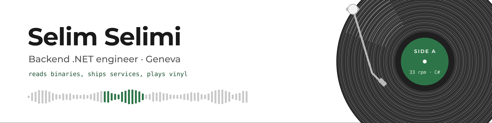

<picture>
  <source media="(prefers-color-scheme: dark)" srcset="assets/banner-dark.png">
  
</picture>

I'm Selim, a backend .NET engineer in Geneva. Seven years of C#, five of them keeping one business platform alive in production: 5,000+ users, a SQL Server schema I designed, a .NET Framework 4.8 → .NET Core migration done without stopping the service, PostFinance payments behind a webhook secured with a shared secret, and third-level support straight from the people using it.

Off the clock I take things apart to see how they work. A game engine, read back from its binary. A DJ set, read from the sound itself.

### Things I'm building

| Project | What it does |
|---|---|
| [**bully-re**](https://github.com/LiquidSnake0/bully-re) · C++ | Rebuilding the *Bully: Scholarship Edition* engine from the shipped binary. File formats, animations, collisions and the AI behaviour trees are decoded and checked against the real game data, then rendered: pedestrians walk their patrols, smoke on the wall, sit on benches and pick fights. |
| [**legacy-lens**](https://github.com/LiquidSnake0/legacy-lens) · C# | Ask questions about a legacy codebase and get answers with line-level citations you can verify. A local RAG pipeline in .NET: nothing leaves the machine. |
| [**cover-pool-kafka**](https://github.com/LiquidSnake0/cover-pool-kafka) · C# | Mortgage loan events replayed through Kafka into a covered bond cover pool, with LTV and eligibility rules. |
| [**emotion-calculator**](https://github.com/LiquidSnake0/emotion-calculator) · C# | Real-time visuals for a vinyl DJ set. The tempo is derived from the signal, never read from a tag, so it survives the pitch fader. |
| [**crate**](https://github.com/LiquidSnake0/crate) · TypeScript | A PWA for my record crate: Camelot keys after pitch, genre colours, and which track can follow which, live. |
| [**rea**](https://github.com/LiquidSnake0/rea) · TypeScript | My fork of REA, the MCP server that lets AI agents drive Ghidra and other reverse-engineering tools. I use it daily on bully-re and send what I fix back upstream. |

### Open source

- [rea #974](https://github.com/morluto/rea/pull/974): a configurable Ghidra startup deadline for REA, the MCP server that lets agents drive Ghidra. Found the hard way, on an 8 MB binary that needed more than the fixed 330 seconds.

### What I work with

C# · .NET · ASP.NET Core · Entity Framework · SQL Server · Kafka · Blazor · React / TypeScript · Docker · Terraform · Ghidra

### Away from the keyboard

Most days include a training session and some time behind the decks, mixing vinyl on a Pioneer DDJ-FLX4. I grew up on 90s consoles and still tinker with retro handhelds, which is where the urge to open a game and see how it works comes from. Before backend work I wrote a WPF app that let quadriplegic users drive their wheelchair with their eyes, talking to an Arduino over a serial link.

---

**Open to backend .NET roles in Geneva and Lausanne.** The best way to reach me is [LinkedIn](https://www.linkedin.com/in/selim-selimi-4a2b55172/).
